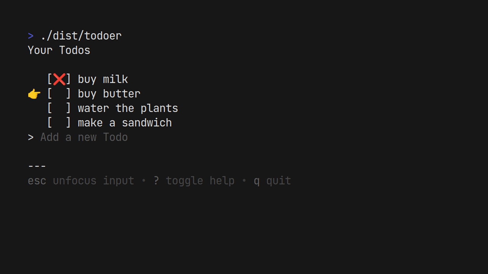

# Todo-er

A cool CLI tool to manage your todos.

## Acknowledgements

- [Bubbletea](https://github.com/charmbracelet/bubbletea)
- [Bubbles](https://github.com/charmbracelet/bubbles)

## Demo



## Installation

Install from source

- Clone the repository

```bash
  git clone
  cd todoer
```

- Build the project

```bash
make build
```

- Run the binary

```bash
make run
```

Install from releases

Head on to the [releases page](https://github.com/CinematicCow/todoer/releases/) and download the binary. After downloading, set permissions for the binary to execute.

```bash
chmod +x todoer
```

Now, simply execute the binary

```bash
./todoer
```

## Usage/Examples

- To add a new todo, simply enter the todo text and hit enter.
- Press `esc` to unfocus the text input and move around.
- Move up & down via the arrow keys or `kj` vim keybinding.
- Press `space` to cross off a todo.
- To delete all completed todos press `D`
- For more press `?`

## Feedback

If you have any feedback, please open up an issue.

## Roadmap

- [ ] Additional OS support
- [x] Add a datasource for consistent data
- [ ] Work on the UI

## License

[MIT](https://choosealicense.com/licenses/mit/)
